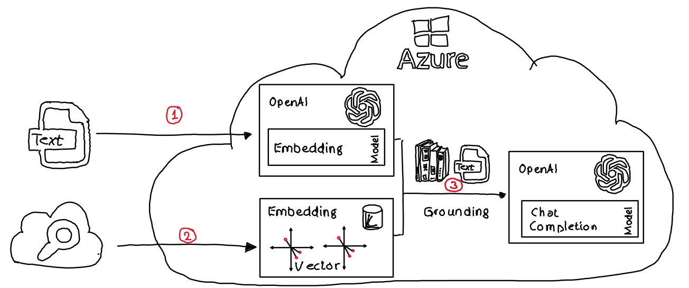
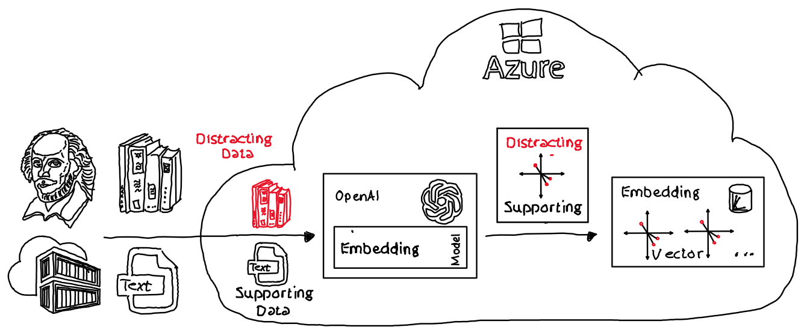
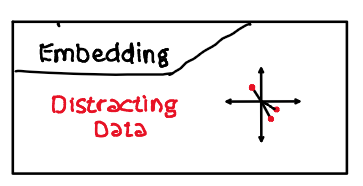
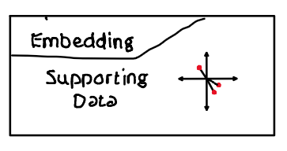
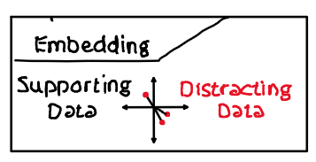
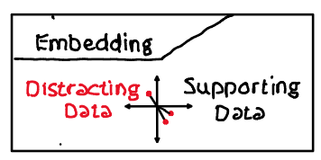

# OpenAI: Composing data for embeddings

## Challenge

Embeddings are numerical representations of words or sentences that capture their semantic meaning. They can be used to perform a vector search, where the query is also converted into an embedding and compared with the embeddings of the data using the cosine distance. The cosine distance measures the angle between two vectors, and the smaller the angle, the more similar they are. By finding the data with the smallest cosine distance to the query, we can retrieve data that has a similar meaning to the query. This data can be used to ground a prompt and perform an OpenAI LLM query, which is a way of generating natural language text based on a given context and a few keywords. The OpenAI LLM query can use the data as a source of information and inspiration to create relevant and coherent text.

### Steps

1) Create embeddings from information
2) Perform a vector search
3) Use data with the smallest cosine distance to ground a prompt


### Problem statement

It is a challenge to group data in one embedding because the data may have different levels of relevance to the query. The data needs to be mostly similar, or at least have a common theme or topic, to form a coherent and meaningful embedding. If there is only a small fraction of the data that is relevant to the query, such as 25%, then the embedding will be dominated by the other 75% of the data that is distracting or irrelevant. The embedding will not capture the semantic meaning of the query well, and the distance of the vector to the query will be too large. This will make it difficult to retrieve the data that is actually useful for the query, and may result in poor performance of the vector search. Therefore, it is important to filter out or reduce the noise in the data before creating an embedding.



## Repository

The repo uses a simplified sample: A query about “ACI container hosting alternatives” should be grounded using a vector search to find data that matches this question. 

Three sources of data are available: 
- parts of the [Azure ACI documentation](./src/assets/acifacts.txt), which provides optimal data for this query, and 
- parts of [“The complete works of William Shakespeare”](./src/assets/shakespearefacts.txt), which is unrelated to the query. 
- parts of the [Azure AKS documentation](./src/assets/aksfacts.txt) which are also unrelated to the query but belong to a similar problem domain.

An embedding is created for each source of data, and compared with the embedding of the query using the cosine distance.

The ACI documentation embedding should have a smaller cosine distance to the query than the Shakespeare and the AKS embedding, because it has more relevant and similar information. However, grouping all the data in one embedding will lose this distinction. 

The embedding will be influenced by all sources of data, and the semantic meaning will be diluted. The cosine distance between the query and the embedding will be larger if there's more 'distracting data' used to create the embedding.

This will make it harder to retrieve the ACI documentation as the best match for the query, and may result in irrelevant or inaccurate results. Therefore, grouping data in one embedding is a challenge when the data has different levels of relevance to the query.

### Sample Code

The [c# sample code](./src/Embeddings.ipynb) combines 'distracting data' with 'supporting data', creates enbeddings and caluclates the cosine distance.

- In detail the cosine distance will be calculated for embeddings with ***only distracting data***. Shakespeare's book and the Azure AKS documentation are treated as 'distracting data':

    

- The cosine distance will be calculated for embeddings with ***"supporting data" only***. Here the 'Azure ACI documentation' is used:

    

- The cosine distance will be calculated for embeddings containing ***supporting and distracting data***. The distracting data will be placed for some embeddings after the supporting data as well as at the start and therefore before the supporting data:

    
    


## Results

The [sample c# app](./src/Embeddings.ipynb) calculates the following cosine distances:

```csharp
Cosine distance:
Cosine distance between query and acifacts: 0.1867628581649723
Cosine distance between query and aksfacts: 0.2501981790410386
Cosine distance between query and shakespearefacts: 0.36902545449461466
Cosine distance between query and distractedGrounding_100_25: 0.18919742913467197
Cosine distance between query and distractedGrounding_100_50: 0.1942534476349791
Cosine distance between query and distractedGrounding_100_75: 0.19264550879180653
Cosine distance between query and distractedGrounding_100_100_aci: 0.18931963697269438
Cosine distance between query and distractedGrounding_25_100: 0.21192521407481446
Cosine distance between query and distractedGrounding_50_100: 0.22273735568962805
Cosine distance between query and distractedGrounding_75_100: 0.22685229402738571
Cosine distance between query and distractedGrounding_100_100_sp: 0.22190080773419452
Cosine distance between query and distracted_aci_aks: 0.19082755856911848
Cosine distance between query and distracted_aks_aci: 0.20782505559110165 


Compare results:
Deviation: non matching facts: 	 97.5904 %
Deviation: similar facts 'AKS':	 33.9657 % 

Distracting data after and before facts
Deviation:25 % 'distracting data' after facts: 	 1.3036 %
Deviation:25 % 'distracting data' before facts:  13.4729 % 

Deviation:50 % 'distracting data' after facts: 	 4.0107 %
Deviation:50 % 'distracting data' before facts:  19.2621 % 

Deviation:75 % 'distracting data' after facts: 	 3.1498 %
Deviation:75 % 'distracting data' before facts:  21.4654 %  

Deviation:100 % 'distracting data' after facts:  1.369 %
Deviation:100 % 'distracting data' before facts: 18.8142 % 
```

### Summary

***As expected***:
- Taking the cosine distance from the ACI documentation (which supports the query best) as base:
  - Shakespeare's book (= just distracting data) has a deviation of ***~ 98 %***.
  - AKS documentation (= distracting data, but somehow related data) has a deviation of ***~ 34 %***

***Learning***:
- There's a major difference if 'distracting data' (= Shakespeare's book) is provided after or before 'supporting data' (= ACI documentation):
  - 'Distracting data' at the beginning: Deviation of ***~ 13 % to ~ 21 %*** depending on the amount of 'distracting data'
  - 'Distracting data' at the end of the text: Deviation of ***~ 1.3 % to ~ 4 %*** depending on the amount of 'distracting data'
- Providing the same amount of 'distracting' and 'supporting' data reduces the cosine distance and therefore reduces the negative impact of 'distracting data':
  - 75 % 'distracting data' before 'supporting data':  Deviaton of ***~ 21.5 %***
  - 100 % 'distracting data' before 'supporting data': Deviation of ***~ 18.8 %*** 

## Learning

Embeddings need to be carefully crafted. If distracting data is placed at the beginning of an embedding, it reduces the similarity between embeddings and vectorized queries that should be close in meaning, because it introduces noise into the vector representation. 

On the other hand, if distracting data is placed at the end of the text, it may have less impact on the embedding. Where increasing the amount of 'distracting data' reduces the cosine distance again. Specificially for the embedding model used in the sample. 

Therefore, it is important to design embeddings that are robust and consistent, and that can capture the essential features of the text.
